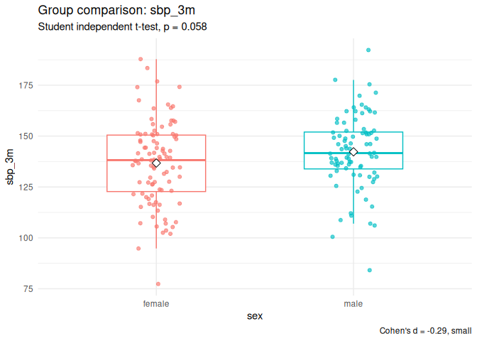

testflow
================


[](https://opensource.org/licenses/MIT)


`testflow` is organized around study design, not test names. Instead of
asking “which function runs a t-test?”, testflow asks: “what is the
design of my study question?”

The core grammar is:

``` r
testflow = test + interpret + plot
```

``` r
library(testflow)

cardio <- make_cardio_data()

x <- cardio |>
  test_two_groups(sbp_3m ~ sex)

x
#> Statistical test workflow
#> 
#> Outcome: sbp_3m 
#> Group: sex 
#> Design: two independent groups 
#> 
#> Assumptions:
#> - Normality by group: acceptable
#> - Homogeneity of variance: acceptable
#> - F-test variance comparison: acceptable
#> 
#> Recommended test:
#> Student independent t-test 
#> 
#> Result:
#> H0: the population mean or location of sbp_3m is equal across levels of sex. 
#> statistic = -1.91, df = 178.00, p = 0.058, 95% CI [-11.22, 0.18] 
#> 
#> Effect size:
#> Cohen's d = -0.29, small
#> 
#> Report:
#> The two independent groups workflow for sbp_3m did not show a statistically significant result using Student independent t-test, statistic = -1.91, df = 178.00, p = 0.058. The 95% confidence interval was [-11.22, 0.18]. The effect size was small (Cohen's d = -0.29). H0: the population mean or location of sbp_3m is equal across levels of sex.
plot(x)
```

<!-- -->

``` r
report(x)
#> [1] "The two independent groups workflow for sbp_3m did not show a statistically significant result using Student independent t-test, statistic = -1.91, df = 178.00, p = 0.058. The 95% confidence interval was [-11.22, 0.18]. The effect size was small (Cohen's d = -0.29). H0: the population mean or location of sbp_3m is equal across levels of sex."
as_tibble(x)
#> # A tibble: 1 × 15
#>   workflow design outcome group recommended_test null_hypothesis statistic    df
#>   <chr>    <chr>  <chr>   <chr> <chr>            <chr>               <dbl> <dbl>
#> 1 two_gro… two i… sbp_3m  sex   Student indepen… H0: the popula…     -1.91   178
#> # ℹ 7 more variables: p <dbl>, conf.low <dbl>, conf.high <dbl>,
#> #   effect_size <dbl>, effect_size_name <chr>, effect_size_magnitude <chr>,
#> #   decision <chr>
```

Printed `testflow` objects use `cli`-styled headings, labels, and values
in the R console. GitHub strips terminal colors, but the rendered
example above shows the updated console structure.

## Summary tables

Use `sumtab()` to build a descriptive table and, when requested, add
automatically selected p-values by variable type and group structure.

``` r
sumtab(~ age + sex + sbp_3m | treatment, cardio, p_value = TRUE)
#> # A tibble: 4 × 8
#>   variable level  `Overall (n = 180)` `usual care (n = 55)` `lifestyle (n = 71)`
#>   <chr>    <chr>  <chr>               <chr>                 <chr>               
#> 1 age      <NA>   57.9 (10.7); 58.0 … 56.3 (10.0); 56.0 [5… 59.4 (10.4); 60.0 […
#> 2 sex      female 96 (53.3%)          32 (58.2%)            39 (54.9%)          
#> 3 sex      male   84 (46.7%)          23 (41.8%)            32 (45.1%)          
#> 4 sbp_3m   <NA>   139.3 (19.5); 139.… 144.1 (19.3); 146.0 … 140.1 (18.2); 139.4…
#> # ℹ 3 more variables: `medication (n = 54)` <chr>, p.value <chr>, test <chr>
```

The public workflows are named for common study designs:

``` r
test_one_sample(cardio, sbp_3m, mu = 140)
test_two_groups(sbp_3m ~ sex, data = cardio)
test_paired(sbp_3m ~ sbp_baseline, data = cardio)
test_groups(sbp_3m ~ treatment, data = cardio)
test_factorial(sbp_3m ~ sex * treatment, data = cardio)
test_categorical(treatment ~ controlled_3m, data = cardio)
test_correlation(sbp_3m ~ age, data = cardio)
test_outliers(cardio, c(sbp_3m, ldl, crp))
sumtab(~ age + sex + sbp_3m | treatment, cardio, p_value = TRUE)
```

## Implemented workflows and tests

Each workflow returns a `testflow` object with the recommended test, H0,
p-value, confidence interval when available, appropriate effect size,
report text, and plot. For descriptive reporting, `sumtab()` builds a
formula-driven summary table and can add automatically selected
p-values.

The exact formulas used for Cohen’s d and the other reported effect-size
estimates are documented in `vignettes/effect-size-formulas.Rmd`.

| Workflow                | Formula-oriented call                                                                     | Tests considered                                                                                              |
|-------------------------|-------------------------------------------------------------------------------------------|---------------------------------------------------------------------------------------------------------------|
| Summary table           | `sumtab(~ age + sex + sbp_3m \| treatment, cardio, p_value = TRUE)`                       | Student t-test, Welch t-test, Wilcoxon rank-sum, ANOVA, Welch ANOVA, Kruskal-Wallis, chi-square, Fisher exact |
| One sample              | `test_one_sample(cardio, sbp_3m, mu = 140)`                                               | one-sample t-test, Wilcoxon signed-rank, sign test                                                            |
| Two independent groups  | `test_two_groups(sbp_3m ~ sex, data = cardio)`                                            | Student t-test, Welch t-test, Wilcoxon rank-sum                                                               |
| Paired measurements     | `test_paired(sbp_3m ~ sbp_baseline, data = cardio)`                                       | paired t-test, Wilcoxon signed-rank, sign test                                                                |
| More than two groups    | `test_groups(sbp_3m ~ treatment, data = cardio)`                                          | one-way ANOVA + Tukey, Welch ANOVA + Welch pairwise t-tests, Kruskal-Wallis + pairwise Wilcoxon               |
| Factorial design        | `test_factorial(sbp_3m ~ sex * treatment, data = cardio)`                                 | factorial ANOVA with main effects and interactions                                                            |
| Repeated measurements   | `test_repeated(cardio, c(sbp_baseline, sbp_3m, sbp_6m), id = id)`                         | repeated-measures ANOVA + paired t-tests, Friedman + paired Wilcoxon                                          |
| Categorical association | `test_categorical(treatment ~ controlled_3m, data = cardio)`                              | chi-square independence test, Fisher exact test                                                               |
| Paired categorical      | `test_paired_categorical(cardio, controlled_baseline, controlled_3m)`                     | McNemar test                                                                                                  |
| Repeated categorical    | `test_repeated_categorical(cardio, c(controlled_baseline, controlled_3m, controlled_6m))` | Cochran Q test + pairwise McNemar tests                                                                       |
| One proportion          | `test_proportion(cardio, controlled_3m, success = "yes", p = 0.5)`                        | exact binomial test, one-sample proportion test                                                               |
| Multinomial             | `test_multinomial(cardio, treatment)`                                                     | chi-square goodness-of-fit, pairwise binomial checks                                                          |
| Correlation             | `test_correlation(sbp_3m ~ age, data = cardio)`                                           | Pearson, Spearman, Kendall                                                                                    |
| Correlation matrix      | `test_correlation_matrix(cardio, c(age, sbp_3m, ldl))`                                    | matrix of Pearson/Spearman/Kendall correlations                                                               |
| Outliers                | `test_outliers(cardio, c(sbp_3m, ldl, crp))`                                              | IQR outliers, Mahalanobis distance                                                                            |

## References

- Fisher, R. A. (1925). .
- Gosset, W. S. (1908). The probable error of a mean.
- Welch, B. L. (1947). Generalization of Student’s problem with unequal
  variances.
- Wilcoxon, F. (1945). Individual comparisons by ranking methods.
- Mann, H. B., & Whitney, D. R. (1947). On a test of whether one of two
  random variables is stochastically larger than the other.
- Levene, H. (1960). Robust tests for equality of variances.
- Kruskal, W. H., & Wallis, W. A. (1952). Use of ranks in one-criterion
  variance analysis.
- Tukey, J. W. (1949). Comparing individual means in the analysis of
  variance.
- Dunn, O. J. (1964). Multiple comparisons using rank sums.
- Friedman, M. (1937). The use of ranks to avoid the assumption of
  normality implicit in the analysis of variance.
- Cochran, W. G. (1950). The comparison of percentages in matched
  samples.
- McNemar, Q. (1947). Note on the sampling error of the difference
  between correlated proportions or percentages.
- Pearson, K. (1895, 1900).
- Spearman, C. (1904). The proof and measurement of association between
  two things.
- Kendall, M. G. (1938). A new measure of rank correlation.
- Cramer, H. (1946). .
- Clopper, C. J., & Pearson, E. S. (1934). The use of confidence or
  fiducial limits illustrated in the case of the binomial.
- Cohen, J. (1988). .
