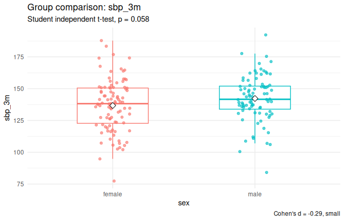
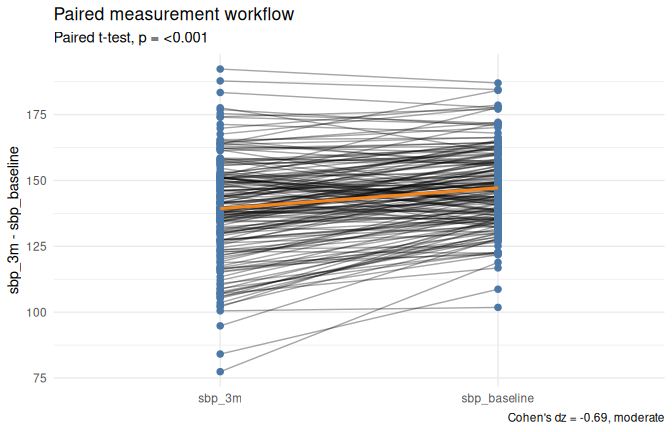
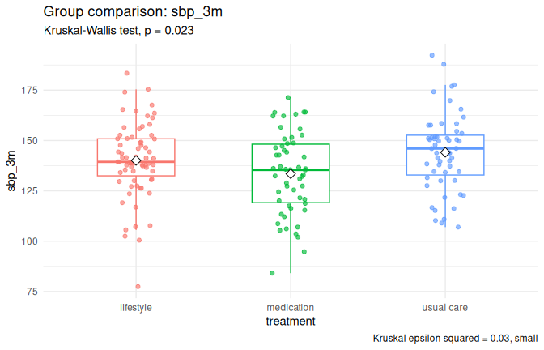
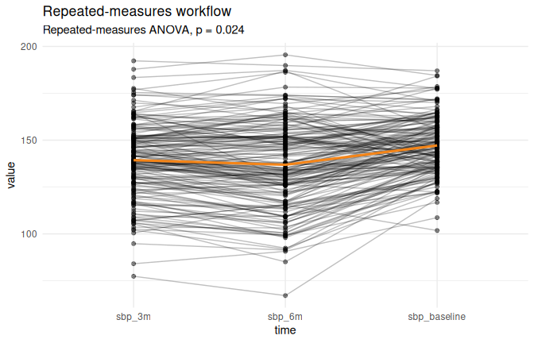
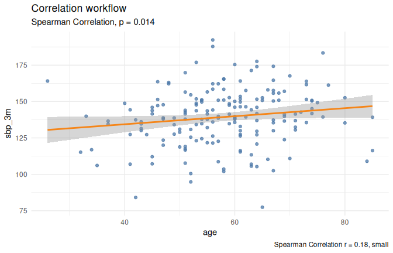
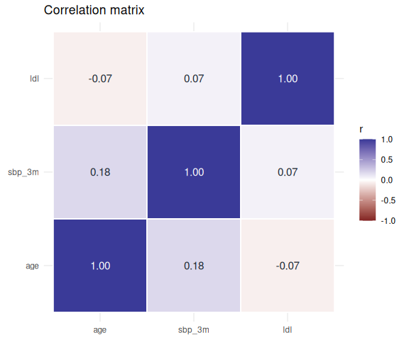
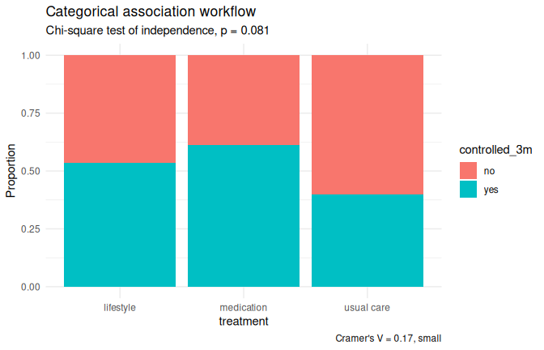
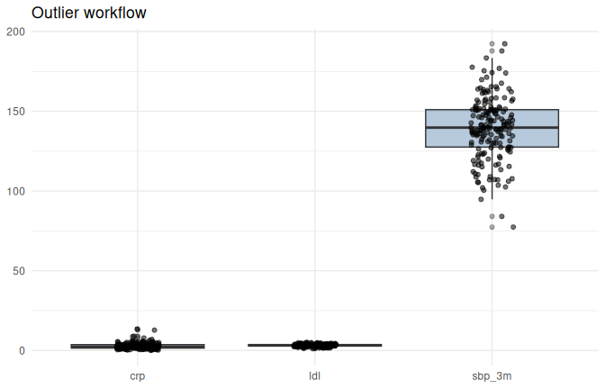

testflow
================


[](https://opensource.org/licenses/MIT)


Current development release: `0.9.0`. First public release: `0.7.0`.

`testflow` helps choose, run, and report common statistical tests from
the study design. The package returns a consistent object with
assumptions, the recommended test, the null hypothesis, the result, an
effect size when appropriate, a plain-language report, and an optional
plot.

The guiding idea is:

``` r
testflow = design + assumptions + test + effect size + report + plot
```

## About

`testflow` is an R package for teaching and applied statistical
workflows. It keeps the statistical question organized around the study
design, then combines assumption checks, test selection, effect sizes,
visual diagnostics, and ready-to-use reporting in one object.

It is designed for analysts, students, and instructors who want a
reproducible path from a data question to a statistical test, a plot,
and a concise written interpretation.

## Installation

`testflow` is not on CRAN yet. Install the development version from
GitHub:

``` r
install.packages("remotes")
remotes::install_github("ielbadisy/testflow")
```

## Quick Start

``` r
library(testflow)

cardio <- make_cardio_data()

res <- test_two_groups(sbp_3m ~ sex, data = cardio, plot = TRUE)
res
#> Two Independent Groups
#> 
#> Outcome: sbp_3m
#> Group: sex
#> 
#> Assumptions
#> * Independence of observations: assumed: Assumed from study design.
#> * Normality: sbp_3m (female): acceptable: Approximate normality looks reasonable. (method=Shapiro-Wilk; statistic=0.99; p=0.913)
#> * Normality: sbp_3m (male): acceptable: Approximate normality looks reasonable. (method=Shapiro-Wilk; statistic=0.98; p=0.233)
#> * Variance homogeneity: acceptable: Variance homogeneity looks reasonable. (method=Levene test; statistic=1.57)
#> * Extreme outliers: warning: 4 potential outlier(s) flagged by IQR. (IQR rule, n = 4)
#> * Variance ratio check: acceptable: Variance ratio looks reasonable. (statistic=1.27)
#> 
#> Recommended test
#> Student independent t-test
#> 
#> Result
#> H0: the population mean or location of sbp_3m is equal across levels of sex.
#> statistic = -1.91, df = 178.00, p = 0.058, 95% CI [-11.22, 0.18]
#> 
#> Effect size
#> Cohen's d: -0.29, small
#> 
#> Report
#> The two independent groups workflow for sbp_3m did not show a statistically significant result using Student independent t-test, statistic = -1.91, df = 178.00, p = 0.058. The 95% confidence interval was [-11.22, 0.18]. The effect size was small (Cohen's d = -0.29). H0: the population mean or location of sbp_3m is equal across levels of sex.
```

``` r
report(res)
#> [1] "The two independent groups workflow for sbp_3m did not show a statistically significant result using Student independent t-test, statistic = -1.91, df = 178.00, p = 0.058. The 95% confidence interval was [-11.22, 0.18]. The effect size was small (Cohen's d = -0.29). H0: the population mean or location of sbp_3m is equal across levels of sex."
as_tibble(res)
#> # A tibble: 1 × 15
#>   workflow design outcome group recommended_test null_hypothesis statistic    df
#>   <chr>    <chr>  <chr>   <chr> <chr>            <chr>               <dbl> <dbl>
#> 1 two_gro… two i… sbp_3m  sex   Student indepen… H0: the popula…     -1.91   178
#> # ℹ 7 more variables: p <dbl>, conf.low <dbl>, conf.high <dbl>,
#> #   effect_size <dbl>, effect_size_name <chr>, effect_size_magnitude <chr>,
#> #   decision <chr>
```

``` r
plot(res)
```

<!-- -->

Printed results use `cli` styling in interactive R sessions. GitHub
strips terminal colors, but the structure is the same in the console. To
control colors explicitly, use:

``` r
options(testflow.cli_colors = FALSE)
options(testflow.cli_colors = TRUE)
```

## Complete Workflow

A typical analysis starts with the study question, lets `testflow` check
the assumptions, then uses the returned object for the report, tidy
result, and plot.

``` r
paired <- test_paired(sbp_3m ~ sbp_baseline, data = cardio, plot = TRUE)

paired
#> Paired Measurements
#> 
#> Outcome: sbp_3m - sbp_baseline
#> 
#> Assumptions
#> * Independence of observations: assumed: Paired observations from the same subjects are assumed by design.
#> * Normality: diff: acceptable: Approximate normality looks reasonable. (method=Shapiro-Wilk; statistic=0.99; p=0.557)
#> * Symmetry of paired differences: not checked: Normality made the symmetry check unnecessary.
#> * Extreme outliers: warning: 1 potential outlier(s) flagged by IQR. (IQR rule, n = 1)
#> 
#> Recommended test
#> Paired t-test
#> 
#> Result
#> H0: the mean or median paired difference (sbp_3m - sbp_baseline) equals 0.
#> statistic = -9.20, df = 179.00, p = <0.001, 95% CI [-9.53, -6.16]
#> 
#> Effect size
#> Cohen's dz: -0.69, moderate
#> 
#> Report
#> The paired measurements workflow for sbp_3m - sbp_baseline showed a statistically significant result using Paired t-test, statistic = -9.20, df = 179.00, p = <0.001. The 95% confidence interval was [-9.53, -6.16]. The effect size was moderate (Cohen's dz = -0.69). H0: the mean or median paired difference (sbp_3m - sbp_baseline) equals 0.
report(paired)
#> [1] "The paired measurements workflow for sbp_3m - sbp_baseline showed a statistically significant result using Paired t-test, statistic = -9.20, df = 179.00, p = <0.001. The 95% confidence interval was [-9.53, -6.16]. The effect size was moderate (Cohen's dz = -0.69). H0: the mean or median paired difference (sbp_3m - sbp_baseline) equals 0."
as_tibble(paired)
#> # A tibble: 1 × 15
#>   workflow design outcome group recommended_test null_hypothesis statistic    df
#>   <chr>    <chr>  <chr>   <chr> <chr>            <chr>               <dbl> <dbl>
#> 1 paired   paire… sbp_3m… <NA>  Paired t-test    H0: the mean o…     -9.20   179
#> # ℹ 7 more variables: p <dbl>, conf.low <dbl>, conf.high <dbl>,
#> #   effect_size <dbl>, effect_size_name <chr>, effect_size_magnitude <chr>,
#> #   decision <chr>
```

``` r
plot(paired)
```

<!-- -->

## Plot Gallery

Different designs produce different visual summaries. These examples use
the same teaching dataset so the function call, statistical result, and
plot stay together.

``` r
groups <- test_groups(sbp_3m ~ treatment, data = cardio, plot = TRUE)
repeated <- test_repeated(cardio, c(sbp_baseline, sbp_3m, sbp_6m), id = id, plot = TRUE)
correlation <- test_correlation(sbp_3m ~ age, data = cardio, plot = TRUE)
cor_matrix <- suppressWarnings(test_correlation_matrix(cardio, c(age, sbp_3m, ldl), plot = TRUE))
categorical <- test_categorical(treatment ~ controlled_3m, data = cardio, plot = TRUE)
outliers <- suppressWarnings(test_outliers(c(sbp_3m, ldl, crp), data = cardio, plot = TRUE))
```

### More Than Two Groups

``` r
plot(groups)
```

<!-- -->

You can keep the default plot style while changing labels:

``` r
plot(
  groups,
  title = "Systolic blood pressure by treatment",
  subtitle = "Automatically selected test and p-value are still available in the result object",
  caption = "Teaching dataset generated by make_cardio_data()"
)
```

### Repeated Measurements

``` r
plot(repeated)
```

<!-- -->

### Correlation

``` r
plot(correlation)
```

<!-- -->

### Correlation Matrix

Cell labels show the pairwise correlation coefficient (`r`).

``` r
plot(cor_matrix)
```

<!-- -->

### Categorical Association

``` r
plot(categorical)
```

<!-- -->

### Outlier Screening

For IQR screening, points below `Q1 - 1.5 x IQR` or above
`Q3 + 1.5 x IQR` are flagged. The dashed lines show those fences and red
points are detected outliers.

``` r
plot(outliers)
```

<!-- -->

## Summary Tables

`sumtab()` creates descriptive tables and can add automatically selected
p-values based on variable type and grouping structure.

``` r
sumtab(~ age + sex + sbp_3m | treatment, cardio, p_value = TRUE)
#> # A tibble: 4 × 8
#>   variable level  `Overall (n = 180)` `usual care (n = 55)` `lifestyle (n = 71)`
#>   <chr>    <chr>  <chr>               <chr>                 <chr>               
#> 1 age      <NA>   57.9 (10.7); 58.0 … 56.3 (10.0); 56.0 [5… 59.4 (10.4); 60.0 […
#> 2 sex      female 96 (53.3%)          32 (58.2%)            39 (54.9%)          
#> 3 sex      male   84 (46.7%)          23 (41.8%)            32 (45.1%)          
#> 4 sbp_3m   <NA>   139.3 (19.5); 139.… 144.1 (19.3); 146.0 … 140.1 (18.2); 139.4…
#> # ℹ 3 more variables: `medication (n = 54)` <chr>, p.value <chr>, test <chr>
```

## Sample Size Planning

`testflow` now includes planning functions for common sample-size
problems. The API is organized by endpoint family, design, and
objective:

``` r
sample_size(
  endpoint = "continuous",
  design = "parallel",
  objective = "superiority",
  delta = 5,
  sd = 10,
  alpha = 0.05,
  power = 0.90
)
```

Current helpers:

``` r
sample_size_continuous()
sample_size_binary()
sample_size_survival()
sample_size_ordinal()
sample_size_bioequivalence()
sample_size_precision()
sample_size_adjust_dropout()
sample_size_cluster_adjust()
```

Supported planning settings:

| Endpoint       | Supported design(s)                        | Supported objective(s)                    | Formula family                                                                         |
|----------------|--------------------------------------------|-------------------------------------------|----------------------------------------------------------------------------------------|
| Continuous     | parallel, paired, repeated(2+ time points) | superiority, non-inferiority, equivalence | normal-approximation formulas for mean difference and repeated-measures approximations |
| Binary         | parallel, paired, repeated(2 time points)  | superiority, non-inferiority, equivalence | risk-difference planning and discordant-pair planning                                  |
| Survival       | parallel                                   | superiority, non-inferiority, equivalence | event-based proportional hazards planning, optional uniform-accrual adjustment         |
| Ordinal        | parallel                                   | superiority                               | Noether approximation                                                                  |
| Bioequivalence | crossover, parallel                        | equivalence (TOST)                        | iterative TOST or normal approximation, log scale                                      |
| Precision      | one-sample, two-sample, log-OR             | CI half-width (no power/objective)        | continuous and binary CI-width formulas                                                |

Example:

``` r
paired_ss <- sample_size_continuous(
  design = "paired",
  objective = "superiority",
  delta = 5,
  sd_diff = 10,
  alpha = 0.05,
  power = 0.90
)

paired_ss
plot(paired_ss)
plot(paired_ss, type = "summary")

repeated_ss <- sample_size_continuous(
  design = "repeated",
  n_time = 4,
  correlation = 0.5,
  objective = "superiority",
  delta = 5,
  sd_diff = 10,
  alpha = 0.05,
  power = 0.90
)

repeated_ss
plot(repeated_ss)
plot(repeated_ss, type = "curve")
```

The formulas and reporting language are based on:

Julious, S. A. (2010). *Sample Sizes for Clinical Trials*. Chapman &
Hall/CRC.

## Common Workflows

Use formulas when there is an outcome and a grouping, predictor, or
repeated measure structure. Use tidyselect-style column selection for
multi-column workflows such as repeated measures, correlation matrices,
and outlier screens.

``` r
test_one_sample(cardio, sbp_3m, mu = 140)
test_two_groups(sbp_3m ~ sex, data = cardio)
test_paired(sbp_3m ~ sbp_baseline, data = cardio)
test_groups(sbp_3m ~ treatment, data = cardio)
test_factorial(sbp_3m ~ sex * treatment, data = cardio)
test_repeated(cardio, c(sbp_baseline, sbp_3m, sbp_6m), id = id)
test_categorical(treatment ~ controlled_3m, data = cardio)
test_paired_categorical(cardio, controlled_baseline, controlled_3m)
test_repeated_categorical(cardio, c(controlled_baseline, controlled_3m, controlled_6m))
test_proportion(cardio, controlled_3m, success = "yes", p = 0.5)
test_multinomial(cardio, treatment)
test_correlation(sbp_3m ~ age, data = cardio)
test_correlation_matrix(cardio, c(age, sbp_3m, ldl))
test_outliers(c(sbp_3m, ldl, crp), data = cardio)
sumtab(~ age + sex + sbp_3m | treatment, cardio, p_value = TRUE)
```

## What Is Implemented

| Study design                                | Main function                             | Tests considered                                                                                              |
|---------------------------------------------|-------------------------------------------|---------------------------------------------------------------------------------------------------------------|
| Summary table                               | `sumtab()`                                | Student t-test, Welch t-test, Wilcoxon rank-sum, ANOVA, Welch ANOVA, Kruskal-Wallis, chi-square, Fisher exact |
| One numeric sample                          | `test_one_sample()`                       | one-sample t-test, Wilcoxon signed-rank, sign test                                                            |
| Two independent groups                      | `test_two_groups()`                       | Student t-test, Welch t-test, Wilcoxon rank-sum                                                               |
| Paired numeric measurements                 | `test_paired()`                           | paired t-test, Wilcoxon signed-rank, sign test                                                                |
| More than two groups                        | `test_groups()`                           | one-way ANOVA, Welch ANOVA, Kruskal-Wallis, post hoc comparisons                                              |
| Factorial numeric design                    | `test_factorial()`                        | factorial ANOVA with main effects and interactions                                                            |
| Repeated numeric measurements               | `test_repeated()`, `test_repeated_long()` | repeated-measures ANOVA, Friedman test, paired post hoc tests                                                 |
| Two categorical variables                   | `test_categorical()`                      | chi-square independence test, Fisher exact test                                                               |
| Paired categorical measurements             | `test_paired_categorical()`               | McNemar test                                                                                                  |
| Repeated categorical measurements           | `test_repeated_categorical()`             | Cochran Q test, pairwise McNemar tests                                                                        |
| One proportion                              | `test_proportion()`                       | exact binomial test, one-sample proportion test                                                               |
| Multinomial categories                      | `test_multinomial()`                      | chi-square goodness-of-fit, pairwise binomial checks                                                          |
| Two numeric variables                       | `test_correlation()`                      | Pearson, Spearman, Kendall                                                                                    |
| Correlation matrix                          | `test_correlation_matrix()`               | pairwise Pearson, Spearman, or Kendall correlations                                                           |
| Outlier screening                           | `test_outliers()`                         | IQR rule, Mahalanobis distance                                                                                |
| Continuous outcome, multiple predictors     | `test_linear_regression()`                | ordinary least squares, overall F-test                                                                        |
| Binary outcome, multiple predictors         | `test_logistic_regression()`              | logistic regression, likelihood-ratio test                                                                    |
| Time-to-event outcome, two groups           | `test_survival()`                         | Kaplan-Meier, log-rank test                                                                                   |
| Time-to-event outcome, multiple predictors  | `test_cox()`                              | Cox proportional hazards regression, likelihood-ratio test                                                    |
| Diagnostic test vs. gold standard           | `test_diagnostic()`                       | sensitivity, specificity, predictive values, likelihood ratios                                                |
| Continuous biomarker vs. binary outcome     | `test_roc()`                              | ROC curve, AUC, Youden's J                                                                                    |
| Two raters, categorical                     | `test_agreement()`                        | Cohen's kappa                                                                                                 |
| Multiple raters or measurements, continuous | `test_icc()`                              | intraclass correlation coefficient                                                                            |

Effect-size formulas are documented in
`vignettes/effect-size-formulas.Rmd`.

## References

Bartlett, M. S. (1937). Properties of sufficiency and statistical tests.
*Proceedings of the Royal Society of London. Series A, Mathematical and
Physical Sciences, 160*(901), 268-282.

Clopper, C. J., & Pearson, E. S. (1934). The use of confidence or
fiducial limits illustrated in the case of the binomial. *Biometrika,
26*(4), 404-413.

Cochran, W. G. (1950). The comparison of percentages in matched samples.
*Biometrika, 37*(3/4), 256-266.

Cohen, J. (1988). *Statistical power analysis for the behavioral
sciences* (2nd ed.). Lawrence Erlbaum Associates.

Cramer, H. (1946). *Mathematical methods of statistics*. Princeton
University Press.

Dunn, O. J. (1964). Multiple comparisons using rank sums.
*Technometrics, 6*(3), 241-252.

Fisher, R. A. (1925). *Statistical methods for research workers*. Oliver
and Boyd.

Friedman, M. (1937). The use of ranks to avoid the assumption of
normality implicit in the analysis of variance. *Journal of the American
Statistical Association, 32*(200), 675-701.

Kendall, M. G. (1938). A new measure of rank correlation. *Biometrika,
30*(1/2), 81-93.

Kruskal, W. H., & Wallis, W. A. (1952). Use of ranks in one-criterion
variance analysis. *Journal of the American Statistical Association,
47*(260), 583-621.

Levene, H. (1960). Robust tests for equality of variances. In I. Olkin,
S. G. Ghurye, W. Hoeffding, W. G. Madow, & H. B. Mann (Eds.),
*Contributions to probability and statistics: Essays in honor of Harold
Hotelling* (pp. 278-292). Stanford University Press.

Mahalanobis, P. C. (1936). On the generalized distance in statistics.
*Proceedings of the National Institute of Sciences of India, 2*(1),
49-55.

Mann, H. B., & Whitney, D. R. (1947). On a test of whether one of two
random variables is stochastically larger than the other. *The Annals of
Mathematical Statistics, 18*(1), 50-60.

McNemar, Q. (1947). Note on the sampling error of the difference between
correlated proportions or percentages. *Psychometrika, 12*(2), 153-157.

Pearson, K. (1895). Notes on regression and inheritance in the case of
two parents. *Proceedings of the Royal Society of London, 58*, 240-242.

Pearson, K. (1900). On the criterion that a given system of deviations
from the probable in the case of a correlated system of variables is
such that it can be reasonably supposed to have arisen from random
sampling. *The London, Edinburgh, and Dublin Philosophical Magazine and
Journal of Science, 50*(302), 157-175.

Shapiro, S. S., & Wilk, M. B. (1965). An analysis of variance test for
normality (complete samples). *Biometrika, 52*(3/4), 591-611.

Spearman, C. (1904). The proof and measurement of association between
two things. *The American Journal of Psychology, 15*(1), 72-101.

Student. (1908). The probable error of a mean. *Biometrika, 6*(1), 1-25.

Tukey, J. W. (1949). Comparing individual means in the analysis of
variance. *Biometrics, 5*(2), 99-114.

Welch, B. L. (1947). The generalization of Student's problem when
several different population variances are involved. *Biometrika,
34*(1/2), 28-35.

Wilcoxon, F. (1945). Individual comparisons by ranking methods.
*Biometrics Bulletin, 1*(6), 80-83.
